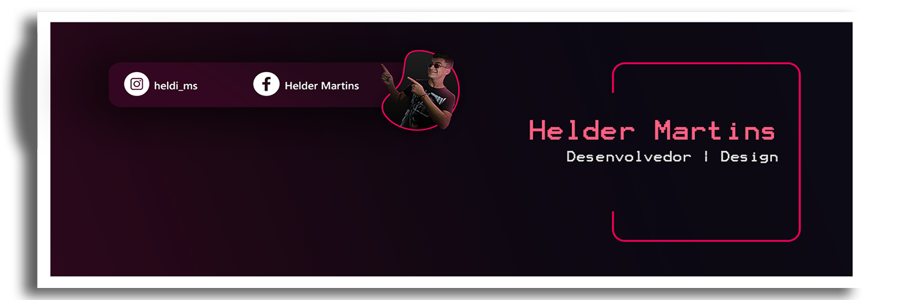

<div align="center">
  <h2>Minhas Tecnologias</h2>
  <div style="display: flex; margin: 20px 0;">
    
    
    
    
    
    
  </div>
</div>

##

```js
  Hello World! 🖖
```

<div align="center">
  <a href="https://github.com/rafaballerini">
  
  
</div>


